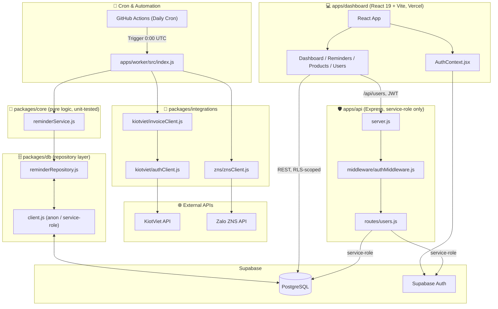

# 📐 KIẾN TRÚC DỰ ÁN ZNS AUTOMATION & DASHBOARD (zns-auto) — v2 (Monorepo)

Hệ thống **ZNS Auto** là giải pháp tự động hóa quy trình chăm sóc khách hàng và nhắc nhở lịch bảo dưỡng/thay nhớt định kỳ cho **Linh Thành Đạt**.

Hệ thống tích hợp giữa **KiotViet API**, cơ sở dữ liệu **Supabase**, dịch vụ gửi tin nhắn **Zalo ZNS**, và một **Web Dashboard** quản trị cho nhân viên và admin.

> **Thay đổi so với v1**: chuyển sang cấu trúc **monorepo** với ranh giới rõ ràng giữa *integration* (gọi API ngoài), *business logic* (tính toán/lọc), và *data access* (Supabase). Toàn bộ codebase dùng **ESM** thống nhất (`import`/`export`), có validate env bằng Zod, logging có cấu trúc, và unit test cho phần logic quan trọng.

---

## 📑 MỤC LỤC
1. [Tổng Quan Hệ Thống](#1-tổng-quan-hệ-thống)
2. [Nguyên Tắc Kiến Trúc](#2-nguyên-tắc-kiến-trúc)
3. [Sơ Đồ Kiến Trúc](#3-sơ-đồ-kiến-trúc)
4. [Công Nghệ Sử Dụng](#4-công-nghệ-sử-dụng)
5. [Cấu Trúc Thư Mục Dự Án (Monorepo)](#5-cấu-trúc-thư-mục-dự-án-monorepo)
6. [Chi Tiết Các Thành Phần](#6-chi-tiết-các-thành-phần)
7. [Cấu Trúc Cơ Sở Dữ Liệu (Database Schema)](#7-cấu-trúc-cơ-sở-dữ-liệu-database-schema)
8. [Biến Môi Trường (Environment Variables)](#8-biến-môi-trường-environment-variables)
9. [Triển Khai & Vận Hành (Deployment)](#9-triển-khai--vận-hành-deployment)
10. [Testing & Code Quality](#10-testing--code-quality)

---

## 1. TỔNG QUAN HỆ THỐNG

Hệ thống gồm 3 luồng chính:
1. **Thu thập dữ liệu tự động (Collector)**: Hằng ngày kết nối với KiotViet API lấy danh sách hóa đơn bán hàng phát sinh, lọc các sản phẩm bảo dưỡng/thay nhớt, tính toán ngày đến hạn (+30 ngày) và lưu vào Supabase.
2. **Gửi tin nhắn tự động (Sender)**: Kiểm tra các lịch nhắc nhở đến hạn trong ngày (`due_date == today` & `sent == false`), tự động gửi tin nhắn Zalo ZNS tới số điện thoại khách hàng và cập nhật trạng thái đã gửi.
3. **Web Dashboard Quản Trị (Frontend & API Server)**: Giao diện web trực quan giúp ban quản lý và nhân viên theo dõi thống kê, tra cứu lịch nhắc nhở, quản lý danh mục sản phẩm nhớt và quản lý tài khoản người dùng.

---

## 2. NGUYÊN TẮC KIẾN TRÚC

Đây là phần khác biệt lớn nhất so với v1 — mọi module mới phải tuân theo 3 lớp tách biệt:

| Lớp | Vai trò | Ví dụ | Được import bởi |
|---|---|---|---|
| **Integration** | Chỉ gọi API bên ngoài (KiotViet, ZNS). Không biết gì về `reminders`. | `packages/integrations/*` | core |
| **Domain / Core** | Logic thuần (tính `due_date`, lọc oil products). Không I/O, dễ unit test. | `packages/core/*` | worker |
| **Repository / DB** | Chỉ CRUD Supabase. Không có logic nghiệp vụ. | `packages/db/*` | core, worker, api |

Quy tắc phụ thuộc: **Integration ⟶ Core ⟶ App** (worker/api). Core không bao giờ phụ thuộc ngược lại App. Điều này cho phép test `reminderService.js` (tính ngày, lọc sản phẩm) mà không cần mock network hay database thật — xem `packages/core/src/reminderService.test.js`.

Ngoài ra:
- **Một nguồn sự thật cho schema**: `packages/shared/src/schemas.js` định nghĩa Zod schema cho `reminders`, `oil_products`, `user_roles` — dùng chung cho worker, api, và dashboard, tránh lệch field khi một bên đổi mà bên kia không hay.
- **Service-role key bị cô lập**: chỉ `packages/db/src/client.js#createServiceRoleClient` được gọi, và chỉ từ `apps/api` (route `/api/users`). Worker và dashboard chỉ dùng anon client (chịu RLS).
- **Fail-fast config**: mọi app import `env` từ `packages/shared/src/config.js`, validate bằng Zod lúc khởi động thay vì đọc `process.env.X` rải rác.

---

## 3. SƠ ĐỒ KIẾN TRÚC



---

## 4. CÔNG NGHỆ SỬ DỤNG

| Tầng | Công nghệ / Thư viện | Vai trò |
|---|---|---|
| **Frontend Dashboard** | React 19, Vite 8, React Router v7, Lucide React | Giao diện điều hành, thống kê |
| **Automation Worker** | Node.js 20 (ESM), `fetch` gốc, Zod | Thu thập hóa đơn & gửi ZNS |
| **Admin API Server** | Express.js v5, Cors | REST cho thao tác quản lý user |
| **Database & Auth** | Supabase (PostgreSQL, Supabase Auth, RLS) | Lưu trữ + phân quyền |
| **Cron Job Engine** | GitHub Actions (`daily-reminder.yml`) | Chạy worker hàng ngày 7:00 AM giờ VN |
| **Logging** | `pino` | Log JSON có cấu trúc, dùng chung worker + api |
| **Validation** | `zod` | Validate env vars & schema dữ liệu |
| **Testing** | Node.js built-in test runner (`node --test`) | Unit test cho `packages/core` |
| **Tích hợp ngoài** | KiotViet OAuth2 API, Zalo ZNS HTTP API | Thu thập hóa đơn & gửi tin |

---

## 5. CẤU TRÚC THƯ MỤC DỰ ÁN (MONOREPO)

```
zns-auto/
├── .github/workflows/
│   └── daily-reminder.yml
├── apps/
│   ├── dashboard/                 # React + Vite frontend (Vercel)
│   │   ├── src/
│   │   │   ├── components/
│   │   │   ├── contexts/          # AuthContext.jsx
│   │   │   ├── lib/                # Supabase client (browser)
│   │   │   ├── pages/              # Dashboard, Reminders, Products, Users, Login
│   │   │   └── App.jsx / main.jsx
│   │   └── package.json
│   ├── api/                       # Express Admin API (service-role only)
│   │   ├── src/
│   │   │   ├── middleware/authMiddleware.js
│   │   │   ├── routes/users.js
│   │   │   └── server.js
│   │   └── package.json
│   └── worker/                    # Cron entry point (replaces reminderScheduler.js)
│       ├── src/
│       │   ├── collect.js         # orchestrates integrations + core + db
│       │   ├── send.js
│       │   └── index.js
│       └── package.json
├── packages/
│   ├── core/                      # Pure business logic (unit-tested)
│   │   └── src/reminderService.js (+ .test.js)
│   ├── integrations/              # External API clients only
│   │   └── src/{kiotviet,zns}/
│   ├── db/                        # Supabase repository layer
│   │   └── src/{client,reminderRepository}.js
│   └── shared/                    # Types/schemas, config, errors, logger
│       └── src/{schemas,config,errors,logger}.js
├── .env.example
├── .eslintrc.json
├── .prettierrc.json
├── ARCHITECTURE.md
└── package.json                   # npm workspaces root
```

---

## 6. CHI TIẾT CÁC THÀNH PHẦN

### 6.1. Worker (`apps/worker`)
Thay thế `reminderScheduler.js` cũ. Chỉ điều phối — không chứa logic:
1. `collect.js`: gọi `fetchInvoicesForDate` (integrations) → `buildReminderFromInvoice` (core, thuần) → `ReminderRepository.insert` (db).
2. `send.js`: `ReminderRepository.findDueToday` (db) → `sendZnsMessage` (integrations) → `ReminderRepository.markSent` (db).

### 6.2. Core (`packages/core`)
`reminderService.js` chứa 2 hàm thuần, không I/O:
- `buildReminderFromInvoice(invoice, oilProductIds)`: lọc sản phẩm nhớt + tính `due_date = purchase_date + 30 ngày`.
- `isDueToday(reminder, todayIso)`: kiểm tra điều kiện gửi.

Có sẵn unit test (`reminderService.test.js`) chạy bằng `node --test`, không cần mock network/DB.

### 6.3. Dashboard (`apps/dashboard`)
- `AuthContext.jsx`: đăng nhập Email/Password qua Supabase Auth, tải vai trò từ `user_roles`.
- `Pages`: Dashboard (thống kê), Reminders (tra cứu/lọc), Products (danh mục nhớt), Users (gọi `/api/users` của `apps/api`).
- Dùng chung `ReminderSchema`/`OilProductSchema` từ `packages/shared` để validate response, tránh lệch field với backend.

### 6.4. Admin API (`apps/api`)
- `authMiddleware.js`: xác thực JWT qua anon client + kiểm tra `role === 'admin'` trong `user_roles`.
- `routes/users.js`: thao tác `auth.admin.*` bằng **service-role client** — đây là nơi DUY NHẤT trong hệ thống được phép dùng key này.

---

## 7. CẤU TRÚC CƠ SỞ DỮ LIỆU (DATABASE SCHEMA)

*(Không đổi so với v1 — schema được định nghĩa lại dưới dạng Zod trong `packages/shared/src/schemas.js` để cả 3 app dùng chung.)*

### `reminders`
| Cột | Kiểu | Mô tả |
|---|---|---|
| `id` | `bigint` (PK) | Mã ID tự tăng |
| `invoice_code` | `text` (Unique) | Mã hóa đơn KiotViet |
| `invoice_id` | `bigint` | ID hóa đơn |
| `customer_id` | `bigint` | ID khách hàng |
| `customer_code` | `text` | Mã khách hàng |
| `customer_name` | `text` | Tên khách hàng |
| `phone` | `text` | SĐT nhận ZNS |
| `purchase_date` | `date` | Ngày mua |
| `due_date` | `date` | Ngày nhắc (+30 ngày) |
| `total` | `numeric` | Tổng tiền |
| `products` | `jsonb` | Sản phẩm nhớt trong hóa đơn |
| `sent` | `boolean` | Đã gửi ZNS chưa |
| `sent_at` | `timestamptz` | Thời điểm gửi |
| `created_at` | `timestamptz` | Thời gian tạo |

### `oil_products`
| Cột | Kiểu | Mô tả |
|---|---|---|
| `product_id` | `bigint` (PK) | ID sản phẩm KiotViet |
| `product_name` | `text` | Tên sản phẩm |
| `category_name` | `text` | Danh mục |

### `user_roles`
| Cột | Kiểu | Mô tả |
|---|---|---|
| `user_id` | `uuid` (PK) | ID từ `auth.users` |
| `role` | `text` | `admin` hoặc `staff` |

---

## 8. BIẾN MÔI TRƯỜNG (ENVIRONMENT VARIABLES)

Xem `.env.example` ở gốc repo — được validate tự động bằng Zod (`packages/shared/src/config.js`) lúc mỗi app khởi động, app sẽ thoát ngay với thông báo rõ ràng nếu thiếu biến, thay vì lỗi ngầm lúc chạy cron 7 giờ sáng.

```env
SUPABASE_URL=
SUPABASE_KEY=                     # anon key — worker & api
SUPABASE_SERVICE_ROLE_KEY=        # CHỈ apps/api dùng

VITE_SUPABASE_URL=
VITE_SUPABASE_ANON_KEY=

KIOTVIET_CLIENT_ID=
KIOTVIET_CLIENT_SECRET=
KIOTVIET_RETAILER=

ZNS_API_KEY=
ZNS_TEMPLATE_ID=
```

---

## 9. TRIỂN KHAI & VẬN HÀNH (DEPLOYMENT)

1. **`apps/dashboard`**: deploy Vercel, root directory trỏ vào `apps/dashboard`, build command `npm run build --workspace=apps/dashboard` (hoặc cấu hình root `vercel.json`).
2. **`apps/worker`**: chạy qua GitHub Actions (`daily-reminder.yml`), `npm ci` ở root rồi `npm run worker:run`. Secrets lưu trong GitHub Repository Secrets.
3. **`apps/api`**: deploy Node.js server (Render/Railway/VPS), start command `npm run start --workspace=apps/api`.

---

## 10. TESTING & CODE QUALITY

- **Unit test**: `npm run test --workspaces` chạy `node --test` cho `packages/core` (và các package khác khi có thêm test).
- **Lint/format**: `npm run lint` / `npm run format` ở root, dùng chung `.eslintrc.json` / `.prettierrc.json` cho toàn bộ monorepo.
- **Gợi ý mở rộng**: thêm integration test mock response KiotViet/ZNS (ví dụ dùng `nock` hoặc `msw`) cho `apps/worker`, và test RLS policies bằng Supabase local (`supabase start`) trước khi merge thay đổi schema.
