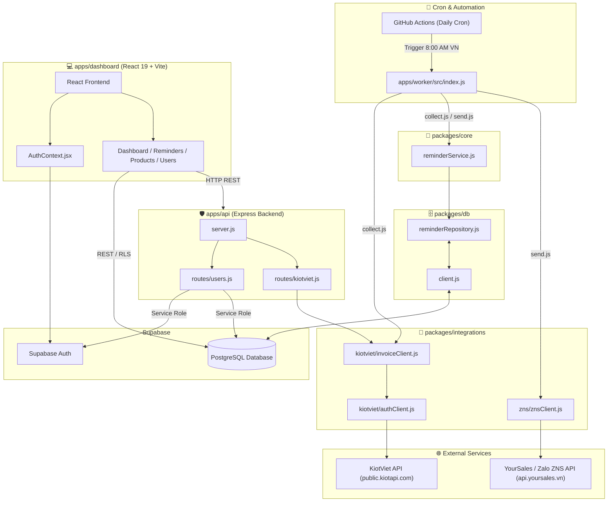

# 📐 KIẾN TRÚC DỰ ÁN ZNS AUTOMATION & DASHBOARD (zns-auto)

Hệ thống **ZNS Auto** là giải pháp tự động hóa quy trình chăm sóc khách hàng và nhắc nhở lịch bảo dưỡng / thay nhớt định kỳ cho **Linh Thành Đạt**.

Hệ thống tích hợp giữa **KiotViet API**, cơ sở dữ liệu **Supabase**, dịch vụ gửi tin nhắn **Zalo ZNS** (qua cổng YourSales API), và một **Web Dashboard** quản trị dành cho nhân viên & ban quản lý.

---

## 📑 MỤC LỤC

1. [Tổng Quan Hệ Thống](#1-tổng-quan-hệ-thống)
2. [Nguyên Tắc Kiến Trúc (Monorepo)](#2-nguyên-tắc-kiến-trúc-monorepo)
3. [Sơ Đồ Kiến Trúc](#3-sơ-đồ-kiến-trúc)
4. [Công Nghệ Sử Dụng](#4-công-nghệ-sử-dụng)
5. [Cấu Trúc Thư Mục Chi Tiết](#5-cấu-trúc-thư-mục-chi-tiết)
6. [Chi Tiết Các Lớp & Luồng Nghiệp Vụ](#6-chi-tiết-các-lớp--luồng-nghiệp-vụ)
   - [6.1. Thu thập dữ liệu (Collector Worker)](#61-thu-thập-dữ-liệu-collector-worker)
   - [6.2. Phân loại sản phẩm nhớt (Oil Products Identification)](#62-phân-loại-sản-phẩm-nhớt-oil-products-identification)
   - [6.3. Gửi tin nhắn ZNS & Chuẩn hóa SĐT (Sender Worker)](#63-gửi-tin-nhắn-zns--chuẩn-hóa-sđt-sender-worker)
   - [6.4. Web Dashboard & Admin API](#64-web-dashboard--admin-api)
7. [Cấu Trúc Cơ Sở Dữ Liệu (Database Schema)](#7-cấu-trúc-cơ-sở-dữ-liệu-database-schema)
8. [Quy Định Hạn Mức Tần Suất Zalo ZNS (Rate Limits)](#8-quy-định-hạn-mức-tần-suất-zalo-zns-rate-limits)
9. [Biến Môi Trường (Environment Variables)](#9-biến-môi-trường-environment-variables)

---

## 1. TỔNG QUAN HỆ THỐNG

Hệ thống gồm 3 luồng hoạt động chính:

1. **Thu thập dữ liệu tự động (`apps/worker/src/collect.js`)**:
   - Hằng ngày kết nối với KiotViet API lấy danh sách hóa đơn bán hàng phát sinh trong 24h qua.
   - Đọc tập hợp `product_id` nhớt từ bảng `oil_products` trên Supabase.
   - Lọc hóa đơn có chứa sản phẩm nhớt (`isOilInvoice`), tính toán ngày đến hạn nhắc (`due_date = purchase_date + 30 ngày`).
   - Tự động hủy các lịch nhắc cũ trùng khách/xe chưa tới hạn (`cancelReminders`) và lưu lịch nhắc mới vào Supabase (`insertReminders`).

2. **Gửi tin nhắn tự động (`apps/worker/src/send.js`)**:
   - Truy vấn danh sách lịch nhắc nhở đến hạn trong ngày (`due_date == today`, `sent == false`, `cancelled == false`).
   - Chuẩn hóa số điện thoại (`normalizePhone`: xử lý gọt số 0 thừa như `00813745627` $\rightarrow$ `0813745627`).
   - Gửi tin nhắn Zalo ZNS qua YourSales API (`https://api.yoursales.vn/api/public/zns/send`).
   - Đánh dấu trạng thái đã gửi (`markSent`).

3. **Web Dashboard & Admin API Server (`apps/dashboard` & `apps/api`)**:
   - **Web Dashboard**: Giao diện React 19 + Vite hiển thị thống kê tổng quan, quản lý lịch nhắc nhở (Reminders), chi tiết hóa đơn (InvoiceDetail), danh mục sản phẩm (Products), và quản lý tài khoản người dùng (Users).
   - **Admin API**: REST API bằng Express.js sử dụng Supabase Service Role Key để thực hiện các thao tác quản lý user nâng cao (`/api/users`) và proxy hóa đơn/khách hàng từ KiotViet (`/api/kiotviet`).

---

## 2. NGUYÊN TẮC KIẾN TRÚC (MONOREPO)

Hệ thống tuân thủ mô hình **Monorepo** với 3 lớp độc lập:

| Lớp | Thư mục | Vai trò | Được import bởi |
| --- | --- | --- | --- |
| **Integration** | `packages/integrations/*` | Chỉ gọi API bên ngoài (KiotViet API, YourSales ZNS API). Không chứa logic DB hay nghiệp vụ. | `apps/worker`, `apps/api` |
| **Domain / Core** | `packages/core/*` | Pure Logic thuần (tính `due_date`, lọc `isOilInvoice`, check `isDueToday`). Không I/O, unit-tested. | `apps/worker` |
| **Repository / DB** | `packages/db/*` | Chịu trách nhiệm CRUD dữ liệu với Supabase PostgreSQL (`reminders`, `oil_products`). | `apps/worker`, `apps/dashboard`, `apps/api` |
| **Shared** | `packages/shared/*` | Định nghĩa Zod Schemas (`schemas.js`), Config Zod validation (`config.js`), Logger Pino (`logger.js`). | Toàn bộ monorepo |

---

## 3. SƠ ĐỒ KIẾN TRÚC


```mermaid
flowchart TD
    subgraph Cron ["🤖 Cron & Automation"]
        GHA["GitHub Actions (Daily Cron)"]
        Worker["apps/worker/src/index.js"]
        GHA -->|Trigger 8:00 AM VN| Worker
    end

    subgraph External ["🌐 External Services"]
        KV["KiotViet API (public.kiotapi.com)"]
        ZNS["YourSales / Zalo ZNS API (api.yoursales.vn)"]
    end

    subgraph Integrations ["📡 packages/integrations"]
        KAuth["kiotviet/authClient.js"]
        KInv["kiotviet/invoiceClient.js"]
        ZClient["zns/znsClient.js"]
    end

    subgraph Core ["🧠 packages/core"]
        RSvc["reminderService.js"]
    end

    subgraph DB ["🗄️ packages/db"]
        Repo["reminderRepository.js"]
        Client["client.js"]
    end

    subgraph DataStore ["Supabase"]
        SupaDB[("PostgreSQL Database")]
        SupaAuth["Supabase Auth"]
    end

    Worker -->|collect.js| KInv --> KAuth --> KV
    Worker -->|collect.js / send.js| RSvc --> Repo
    Worker -->|send.js| ZClient --> ZNS
    Repo <--> Client <--> SupaDB

    subgraph Frontend ["💻 apps/dashboard (React 19 + Vite)"]
        ReactApp["React Frontend"]
        AuthCtx["AuthContext.jsx"]
        Pages["Dashboard / Reminders / Products / Users"]
        ReactApp --> AuthCtx --> SupaAuth
        ReactApp --> Pages -->|REST / RLS| SupaDB
    end

    subgraph BackendAPI ["🛡️ apps/api (Express Backend)"]
        Server["server.js"]
        UsersRoute["routes/users.js"]
        KiotRoute["routes/kiotviet.js"]
        Server --> UsersRoute & KiotRoute
        UsersRoute -->|Service Role| SupaAuth & SupaDB
        KiotRoute --> KInv
    end

    Pages -->|HTTP REST| BackendAPI
```

---

## 4. CÔNG NGHỆ SỬ DỤNG

| Tầng | Công nghệ / Thư viện | Vai trò |
| --- | --- | --- |
| **Frontend** | React 19, Vite, React Router v7, Lucide React | Web Dashboard quản trị |
| **Backend API** | Express.js v5, CORS, Zod | REST API Server quản lý user & proxy KiotViet |
| **Automation Worker** | Node.js 24 (ESM), Fetch API gốc | Thu thập hóa đơn & tự động gửi ZNS |
| **Database & Auth** | Supabase (PostgreSQL, RLS Policies, Auth) | Lưu trữ dữ liệu lịch nhắc & sản phẩm |
| **Cron Engine** | GitHub Actions (`daily-reminder.yml`) | Tự động kích hoạt Worker mỗi ngày lúc 8:00 AM VN |
| **Logging** | `pino`, `pino-pretty` | Structured JSON logging |
| **Testing** | Node.js built-in test runner (`node --test`) | Unit test cho `packages/core` |

---

## 5. CẤU TRÚC THƯ MỤC CHI TIẾT

```
zns-auto/
├── .github/workflows/
│   └── daily-reminder.yml          # Workflow chạy worker hàng ngày
├── apps/
│   ├── api/                        # Express Admin API
│   │   ├── src/
│   │   │   ├── middleware/authMiddleware.js
│   │   │   ├── routes/kiotviet.js   # Route proxy KiotViet (invoices, customers)
│   │   │   ├── routes/users.js      # Route quản lý tài khoản & phân quyền
│   │   │   └── server.js            # Khởi tạo Express server
│   │   └── package.json
│   ├── dashboard/                  # React 19 + Vite Web Application
│   │   ├── src/
│   │   │   ├── components/          # Layout, DataTable, StatusBadge, ConfirmDialog...
│   │   │   ├── constants/           # Các định nghĩa hằng số trạng thái
│   │   │   ├── contexts/            # AuthContext, ToastContext
│   │   │   ├── hooks/               # useProducts, useReminders, useDebounce
│   │   │   ├── lib/                 # Supabase client (browser anon)
│   │   │   ├── pages/               # Dashboard, Reminders, InvoiceDetail, Products, Users, Login
│   │   │   ├── services/            # products.service.js, reminders.service.js
│   │   │   └── App.jsx / main.jsx
│   │   └── package.json
│   └── worker/                     # Automation Engine
│       ├── src/
│       │   ├── collect.js           # Thu thập hóa đơn & tạo reminder
│       │   ├── send.js              # Gửi ZNS tin nhắn đến hạn
│       │   └── index.js             # Entry point chạy cả 2 bước collect & send
│       └── package.json
├── packages/
│   ├── core/                       # Pure Business Logic
│   │   └── src/
│   │       ├── reminderService.js   # Logic lọc nhớt, tính due_date, check due
│   │       └── reminderService.test.js
│   ├── db/                         # Supabase Repository Layer
│   │   └── src/
│   │       ├── client.js            # Supabase client factory (Anon & Service Role)
│   │       └── reminderRepository.js # CRUD cho reminders & oil_products
│   ├── integrations/               # API Chỗ kết nối dịch vụ ngoài
│   │   └── src/
│   │       ├── kiotviet/
│   │       │   ├── authClient.js    # Lấy OAuth2 Token từ KiotViet
│   │       │   └── invoiceClient.js # Lấy danh sách hóa đơn & thông tin khách
│   │       └── zns/
│   │           └── znsClient.js     # Normalize SĐT & gọi API gửi ZNS
│   └── shared/                     # Utilities dùng chung toàn hệ thống
│       └── src/
│           ├── config.js            # Validate env vars bằng Zod
│           ├── logger.js            # Pino logger instance
│           └── schemas.js           # Zod schema cho Reminder, OilProduct, UserRole
├── .env.example
├── ARCHITECTURE.md
└── package.json                    # Root npm workspace configuration
```

---

## 6. CHI TIẾT CÁC LỚP & LUỒNG NGHIỆP VỤ

### 6.1. Thu thập dữ liệu (Collector Worker)
* **File khởi chạy:** `apps/worker/src/collect.js` (`collectNewReminders`)
* **Các bước thực hiện:**
  1. `fetchInvoices`: Gọi API KiotViet lấy toàn bộ hóa đơn phát sinh trong 24 giờ qua.
  2. `ReminderRepository.getOilProductIds()`: Truy vấn danh sách `product_id` từ bảng `oil_products` trên Supabase thành `Set<product_id>`.
  3. `isOilInvoice`: So sánh `item.productId` trong `invoiceDetails` của hóa đơn với `oilProductIdsSet`. Nếu chứa `product_id` nhớt thì giữ lại.
  4. `fetchCustomerPhone`: Tải số điện thoại khách hàng từ KiotViet qua `customerId`.
  5. `findPendingByCustomer` & `cancelReminders`: Nếu khách hàng/xe này đã có lịch nhắc cũ chưa tới hạn, tự động hủy lịch nhắc cũ với ghi chú lý do thay thế.
  6. `buildReminderFromInvoice`: Tạo object nhắc nhở với `due_date = purchase_date + 30 ngày` và lấy tối đa 3 sản phẩm đầu tiên.
  7. `insertReminders`: Lưu tập hợp reminder mới vào bảng `reminders` trên Supabase.

### 6.2. Phân loại sản phẩm nhớt (Oil Products Identification)
* **Quy tắc đối chiếu trong Code:**
  Trong [reminderService.js](file:///d:/LTD/zns-auto/packages/core/src/reminderService.js#L4-L7), việc xác định sản phẩm nhớt **hoàn toàn dựa vào phép so sánh ID**:
  ```javascript
  export function isOilInvoice(invoice, oilProductIdsSet) {
    if (!invoice.invoiceDetails || invoice.invoiceDetails.length === 0) return false;
    return invoice.invoiceDetails.some(item => oilProductIdsSet.has(item.productId));
  }
  ```
* **Nguồn dữ liệu của `oil_products`:**
  Các `product_id` đại diện cho sản phẩm nhớt được thêm vào Supabase thông qua:
  - Nút **"Thêm vào nhớt"** ở trang Quản lý sản phẩm trên Web Dashboard (`apps/dashboard/src/services/products.service.js#addProduct`).
  - Hoặc chèn thủ công bởi quản trị viên qua SQL Editor / Supabase Dashboard.

### 6.3. Gửi tin nhắn ZNS & Chuẩn hóa SĐT (Sender Worker)
* **File khởi chạy:** `apps/worker/src/send.js` & `packages/integrations/src/zns/znsClient.js`
* **Chuẩn hóa số điện thoại (`normalizePhone`):**
  Xử lý loại bỏ số `0` dư thừa do thao tác nhập liệu trên KiotViet (ví dụ SĐT bị thừa thành `00813745627` sẽ được chuẩn hóa chính xác thành `0813745627`).
* **Quy trình gửi:**
  1. `ReminderRepository.findDueToday`: Lấy các bản ghi `due_date === today` & `sent === false` & `cancelled === false`.
  2. `sendZNSMessage`: Gửi POST request tới `https://api.yoursales.vn/api/public/zns/send` với ZNS Template ID `499462`.
  3. `ReminderRepository.markSent`: Cập nhật `sent = true` và `sent_at = timestamp`.

### 6.4. Web Dashboard & Admin API
* **Web Dashboard (`apps/dashboard`)**:
  - Tự động đồng bộ trạng thái đăng nhập qua `AuthContext` và Supabase Auth.
  - Trang **Reminders**: Tìm kiếm, lọc danh sách lịch nhắc theo trạng thái (Đã gửi, Chờ gửi, Đã hủy).
  - Trang **Products**: Cho phép xem danh sách nhớt và quản lý/thêm/xóa sản phẩm nhớt theo dõi.
  - Trang **Users**: Cho phép Admin tạo tài khoản nhân viên mới và gán phân quyền `admin` / `staff`.
* **Admin API (`apps/api`)**:
  - Cung cấp các REST endpoint bảo mật sử dụng `SUPABASE_SERVICE_ROLE_KEY` để gọi API quản trị Supabase Auth (`auth.admin.createUser`, `auth.admin.deleteUser`).
  - Cung cấp endpoint proxy dữ liệu từ KiotViet cho Dashboard (`/api/kiotviet/invoices/:code`, `/api/kiotviet/customers/:id`).

---

## 7. CẤU TRÚC CƠ SỞ DỮ LIỆU (DATABASE SCHEMA)

### Bảng `reminders`
| Cột | Kiểu dữ liệu | Mô tả |
| --- | --- | --- |
| `id` | `bigint` (PK) | ID tự tăng |
| `invoice_code` | `text` (Unique) | Mã hóa đơn KiotViet |
| `invoice_id` | `bigint` | ID hóa đơn KiotViet |
| `customer_id` | `bigint` | ID khách hàng KiotViet |
| `customer_code` | `text` | Mã khách hàng |
| `customer_name` | `text` | Tên khách hàng / Tên xe |
| `phone` | `text` | Số điện thoại nhận ZNS |
| `purchase_date` | `date` | Ngày mua hàng / thay nhớt |
| `due_date` | `date` | Ngày đến hạn nhắc (+30 ngày) |
| `total` | `numeric` | Tổng tiền hóa đơn |
| `products` | `jsonb` | Mảng chứa danh sách sản phẩm (`name`, `quantity`) |
| `sent` | `boolean` | Trạng thái đã gửi ZNS |
| `sent_at` | `timestamptz` | Thời điểm gửi ZNS thành công |
| `cancelled` | `boolean` | Đã bị hủy (khi khách thay nhớt lại sớm hơn) |
| `note` | `text` | Ghi chú lý do hủy hoặc thông tin thay thế |
| `created_at` | `timestamptz` | Thời gian tạo bản ghi |

### Bảng `oil_products`
| Cột | Kiểu dữ liệu | Mô tả |
| --- | --- | --- |
| `product_id` | `bigint` (PK) | ID sản phẩm trên KiotViet |
| `product_name` | `text` | Tên sản phẩm nhớt |
| `category_name` | `text` | Tên nhóm hàng KiotViet |

### Bảng `user_roles`
| Cột | Kiểu dữ liệu | Mô tả |
| --- | --- | --- |
| `user_id` | `uuid` (PK) | ID người dùng từ `auth.users` |
| `role` | `text` | Quyền hạn (`admin` hoặc `staff`) |

---

## 8. QUY ĐỊNH HẠN MỨC TẦN SUẤT ZALO ZNS (RATE LIMITS)

Khi vận hành gửi tin ZNS, cần lưu ý quy định giới hạn tần suất gửi tin từ Zalo API:

* **Mã lỗi Zalo ZNS `-1472` (hoặc Yoursales `00005`):**
  `"OA exceeded the limit of sending promotion messages to this user for the day"`
* **Nguyên nhân:**
  Zalo áp dụng chính sách giới hạn tần suất gửi tin nhắn dạng Quảng cáo / Truyền thông / CSKH (Promotion / Tag 3), **chỉ cho phép gửi tối đa 1 tin nhắn đến 1 người dùng (1 SĐT) trong vòng 24 giờ**.
* **Tác động:**
  Nếu một khách hàng có 2 xe (hoặc 2 hóa đơn) trùng lịch nhắc trong cùng 1 ngày, tin nhắn cho xe thứ 1 sẽ gửi thành công, còn tin nhắn cho xe thứ 2 gửi cho cùng SĐT đó trong ngày sẽ bị Zalo từ chối với thông báo lỗi trên.

---

## 9. BIẾN MÔI TRƯỜNG (ENVIRONMENT VARIABLES)

Mọi ứng dụng trong Monorepo tự động kiểm tra biến môi trường lúc khởi động qua Zod Schema (`packages/shared/src/config.js`):

```env
# Supabase Configuration
SUPABASE_URL=https://<your-supabase-project>.supabase.co
SUPABASE_KEY=eyJhbGciOi...          # Supabase Anon Key
SUPABASE_SERVICE_ROLE_KEY=eyJhb...  # Supabase Service Role Key (Chỉ dùng tại apps/api)

# Dashboard Frontend Supabase Config
VITE_SUPABASE_URL=https://<your-supabase-project>.supabase.co
VITE_SUPABASE_ANON_KEY=eyJhbGciOi...

# KiotViet API Integration
KIOTVIET_CLIENT_ID=<your-client-id>
KIOTVIET_CLIENT_SECRET=<your-client-secret>
KIOTVIET_RETAILER=<your-retailer-name>

# YourSales Zalo ZNS API Integration
ZNS_API_KEY=<your-yoursales-api-key>
ZNS_TEMPLATE_ID=499462
```
